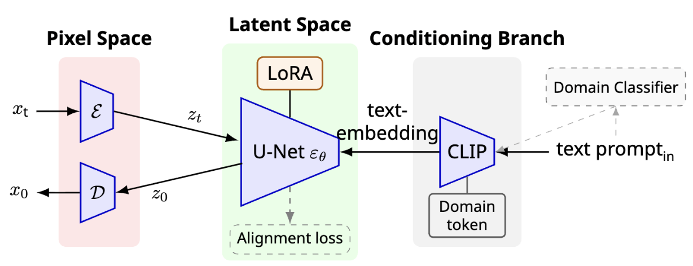
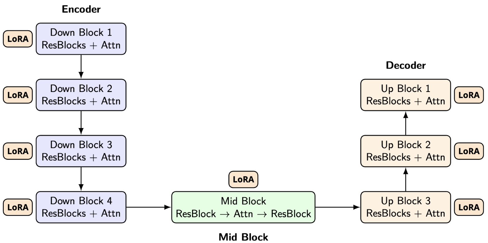
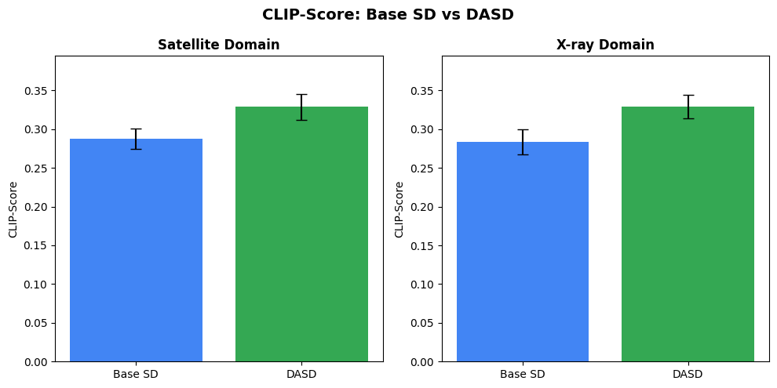

# Domain-Adaptive Stable Diffusion (DASD)

**Parameter-Efficient Adaptation of Latent Diffusion Models for Cross-Domain Image Synthesis**

## Authors

- Zhanhao Liu (zhanhaol@umich.edu)
- Huanchen Jia (jhuanch@umich.edu)
- Kunlong Zhang (kunlong@umich.edu)
- Qiulin Fan (rynnefan@umich.edu)

University of Michigan - EECS 442 Project

---

## Abstract

Latent Diffusion Models (LDMs) like Stable Diffusion have revolutionized image synthesis but often struggle with specialized domains such as medical radiographs or satellite imagery. This failure stems from the drastic distribution shift between the pre-training data (e.g., LAION-5B) and the target domain. While full fine-tuning is computationally prohibitive, standard parameter-efficient methods like LoRA typically focus solely on reconstruction loss, which is insufficient for structural domain shifts.

We propose **Domain-Adaptive Stable Diffusion (DASD)**, a lightweight adaptation framework that enables Stable Diffusion to generalize to visually and semantically distant domains under few-shot settings. DASD modifies the model along three axes:

1. **UNet-side LoRA adapters** capture domain-specific visual features while keeping the backbone frozen
2. **Text-side domain tokens** extend the CLIP conditioning pathway to encode novel domain semantics
3. **Domain-alignment loss (MMD)** regularizes the latent space to reduce distributional shift between source and target domains

Combined with domain-specific inference calibration, DASD achieves strong cross-domain generation quality with minimal training cost.

---

## Method Overview

### Architecture



### Key Components

#### 1. UNet-Side Adaptation (LoRA)

Low-rank adapters are injected into both attention and mid-level convolution layers:

```python
target_modules = [
    # Attention layers
    "to_k", "to_q", "to_v", "to_out.0",
    # Mid-level convolution layers
    "conv1", "conv2"
]
```

The weight update follows:

$$
W_{unet} = W_0 + \Delta W_{LoRA}
$$

Where $W_0$ represents the frozen pretrained weights and $\Delta W_{LoRA}$ captures domain-specific adaptations.



#### 2. Text-Side Adaptation (Domain Tokens)

Domain tokens (e.g., `<satellite>`, `<xray>`) are added to the CLIP vocabulary via textual inversion:

- New embedding vectors are learned for each domain
- Tokens are prepended/appended to prompts during training
- Enables the model to understand novel domain semantics

Example:
```
Original: "a small village near a river"
Adapted:  "<satellite> a small village near a river"
```

#### 3. Domain Alignment Loss (MMD)

Maximum Mean Discrepancy (MMD) aligns source and target latent distributions:

$$
\mathcal{L}_{MMD} = \left\| \frac{1}{N_s} \sum_{i} f_s^{(i)} - \frac{1}{N_t} \sum_{j} f_t^{(j)} \right\|^2
$$

Features are extracted from the UNet mid-block for alignment.

#### 4. Training Objective

The complete loss function:

$$
\mathcal{L} = \mathbb{E}\left[\|\epsilon - \epsilon_\theta(x_t, t)\|^2\right] + \lambda_{align} \cdot \mathcal{L}_{align}
$$

Where the first term is the standard diffusion denoising loss and the second term is the MMD alignment regularizer.

---

## Installation

### Requirements

```bash
# Clone the repository
git clone https://github.com/qiulinfan/Domain-Adaptive-Stable-Diffusion.git
cd Domain-Adaptive-Stable-Diffusion

# Install dependencies
pip install -r requirements.txt
```

Or install manually:

```bash
pip install torch torchvision
pip install diffusers transformers accelerate peft datasets
pip install scipy tqdm ftfy regex matplotlib
```

### Hardware

- GPU with at least 16GB VRAM recommended
- Tested on NVIDIA L4

---

## Usage

### Command Line Interface

The project provides a unified command-line interface through `run.py`:

```bash
# Train the model
python run.py train

# Evaluate trained model against baseline
python run.py evaluate

# Generate images with trained model
python run.py generate --domain satellite --num_images 8

# Generate with automatic domain detection (no token needed)
python run.py generate --auto-domain --prompt "chest scan showing lungs"

# Classify prompts to see which domain they match
python run.py classify --prompt "aerial view of airport"

# Run complete pipeline (train + evaluate + generate)
python run.py all
```

#### Command Line Options

```
python run.py <command> [options]

Commands:
  train       Train the DASD model
  evaluate    Evaluate trained model with CLIP-Score
  generate    Generate images with trained model
  classify    Classify prompts into domains (test the classifier)
  all         Run complete pipeline

Options:
  --output_dir PATH     Output directory (default: dasd_output)
  --checkpoint PATH     Checkpoint directory for evaluation/generation
  --max_steps N         Maximum training steps (default: 1500)
  --prompt TEXT         Custom prompt for generation/classification
  --domain DOMAIN       Domain for generation (satellite, xray)
  --num_images N        Number of images to generate (default: 4)
  --auto-domain         Auto-detect domain from prompt (no token needed)
```

### Python API

You can also use the modular API directly:

```python
from dasd import Config, setup_training, create_datasets, train
from dasd import load_trained_pipeline

# Training
config = Config.setup()
models = setup_training(config)
source_ds, target_ds, sampler = create_datasets(config, models["tokenizer"])
losses = train(config, models, sampler, models["token_ids"])

# Inference
pipeline = load_trained_pipeline("dasd_output/checkpoint-final", config)
image, domain, settings = pipeline.generate("a chest x-ray showing lungs <xray>")
```

### Configuration

Key configuration options in `dasd/config.py`:

```python
class Config:
    MODEL_ID = "runwayml/stable-diffusion-v1-5"

    # Training
    BATCH_SIZE = 1
    GRADIENT_ACCUMULATION = 4
    LR_UNET = 1e-5
    LR_TEXT = 5e-5
    MAX_STEPS = 1500
    LAMBDA_ALIGN = 0.01

    # LoRA
    LORA_RANK = 8
    LORA_ALPHA = 32
    LORA_DROPOUT = 0.1

    # Source-Target mixing ratio
    TARGET_SOURCE_RATIO = 3  # 3:1 target:source
```

### Inference Calibration

Domain-specific generation parameters are automatically applied:

| Domain    | CFG Scale | Steps | Scheduler |
|-----------|-----------|-------|-----------|
| Satellite | 7.0       | 30    | DDIM      |
| X-ray     | 7.5       | 30    | DDIM      |
| Default   | 7.5       | 30    | DDPM      |

---

## Datasets

### Source Domain
- **huggan/few-shot-art-painting**: Natural images for MMD alignment (300 samples)

### Target Domains
- **arampacha/rsicd**: Remote sensing image captioning dataset for satellite imagery (400 samples)
- **hf-vision/chest-xray-pneumonia**: Chest X-ray images for medical imaging domain (400 samples)

---

## Results

### CLIP-Score Evaluation



DASD consistently outperforms the baseline Stable Diffusion model across both domains, demonstrating improved semantic alignment between generated images and text prompts.

Here are some examples of qualitative comparisons between base Stable Diffusion(col 1 and 3) with DASD(col 2 and 4)  on satellite and X-ray domains.


---

## Project Structure

```
Domain-Adaptive-Stable-Diffusion/
├── run.py                  # Main entry point (CLI)
├── API.py                  # Python API usage examples
├── example_running.txt     # Command line examples
├── requirements.txt        # Python dependencies
├── README.md               # This file
├── dasd/                   # Main package
│   ├── __init__.py         # Package exports
│   ├── config.py           # Configuration class
│   ├── datasets.py         # Dataset classes and loaders
│   ├── losses.py           # MMD alignment loss
│   ├── models.py           # Model loading and LoRA setup
│   ├── pipeline.py         # Inference pipeline
│   ├── classifier.py       # Domain classifier (auto-detection)
│   ├── train.py            # Training loop
│   └── evaluate.py         # CLIP-Score evaluation
```

## Acknowledgments

This project was developed as part of EECS 442 (Computer Vision) at the University of Michigan. We thank the Hugging Face team for the Diffusers library and the open-source community for providing the pretrained Stable Diffusion models.

---

## License

This project is for educational and research purposes.
